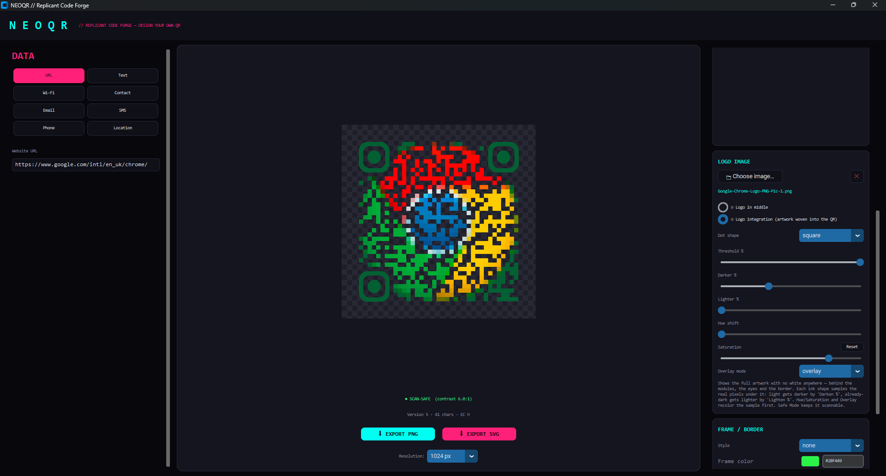
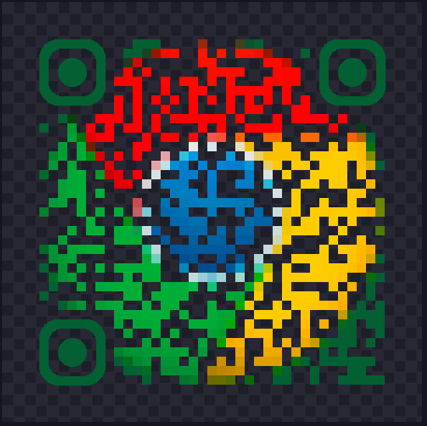

# NeoQR — Replicant Code Forge

A self-contained, Blade-Runner-themed QR code generator for Windows. Encode URLs,
plain text, Wi-Fi credentials, contact cards, email, SMS, phone numbers and GPS
coordinates, then design the code (module shapes, eye styles, gradients, logo,
frame/banner) and export as **PNG (with alpha transparency)** or **SVG (infinitely
scalable vector)**.

Every export is checked by a built-in **Safe Mode** that automatically keeps
foreground/background contrast within scannable range, so the code stays
readable by standard QR scanners regardless of how wild the color scheme is.

This project is open source — fork it, branch it, send a PR. Contributions welcome.

## Screenshots

| App | Logo Integration example |
| --- | --- |
|  |  |

## Download

Grab the latest **`NeoQR.exe`** from the [Releases page](https://github.com/ksavona/neoqr/releases/latest) —
no installation, no Python required, just download and run.

## Run it

```
dist\NeoQR.exe
```

No installation, no Python required — it's a single portable exe.


## Features

- **Data types**: URL, free text, Wi-Fi (auto-join), vCard contact, email,
  SMS, phone, GPS location.
- **Module shapes**: square, dots, rounded, extra-rounded, classy, classy-rounded
  (neighbor-aware corner rounding, identical logic shared by the PNG and SVG
  renderers so both formats match pixel-for-pixel in shape).
- **Eye (finder pattern) styling**: independent frame/ball shapes — square,
  rounded, circle, leaf — with optional custom colors.
- **Color**: solid, linear gradient (angle control) or radial gradient
  foreground; solid or transparent background.
- **Auto color palettes**: pick a base hue and generate complementary,
  analogous, triadic, split-complementary, monochrome and neon-inverse
  palettes with one click — all pre-checked for scan safety.
- **Logo embedding**: two modes —
  - *Logo in middle*: a classic centered logo with an adjustable-thickness
    rounded/circle/square backing plate; error correction is automatically
    bumped to level H whenever a logo is present.
  - *Logo integration*: weaves the whole image into the code itself — every
    dot/cube/star/plus module, the eyes and the border all sample the real
    artwork pixels underneath them, with independent **Threshold / Darker /
    Lighter** sliders, **Hue shift** and **Saturation**, and Photoshop-style
    **overlay blend modes** (multiply, screen, overlay, hue, color, ...).
- **Frame / border**: simple, rounded or banner-style frames with custom
  caption text (e.g. "SCAN ME") — the QR body itself always stays scan-safe
  while the frame carries the neon theme.
- **5 built-in presets**: Blade Runner Neon, Replicant Noir, Tyrell Gold,
  Off-World Cyan, Kowalski Red.
- **Live preview** with a transparency checkerboard and a real-time
  scannability/contrast indicator.
- Export resolution up to 4096px PNG, or fully scalable SVG.

## Rebuilding from source

```powershell
python -m venv .venv
.venv\Scripts\pip install -r requirements.txt
.venv\Scripts\python main.py                 # run from source

.venv\Scripts\python -m PyInstaller --noconfirm --onefile --windowed `
    --name NeoQR --icon assets\icon.ico --collect-all customtkinter main.py
```

The finished executable is written to `dist\NeoQR.exe`.

## Project layout

```
neoqr/
  matrix.py        QR bit-matrix generation + finder-pattern zone detection
  data_builders.py Payload builders (URL, Wi-Fi, vCard, email, SMS, geo, ...)
  geometry.py       Shared neighbor-aware corner-rounding rules
  style.py          QRStyle dataclass + design presets
  palette.py        Color harmony generation + contrast math
  scan_safety.py    Automatic contrast enforcement ("Safe Mode")
  artistic.py       Logo Integration color pipeline (hue/sat/overlay/darken/lighten)
  logo.py           Logo resize + backing plate compositing
  render_png.py     Raster renderer (Pillow + numpy)
  render_svg.py     Vector renderer (hand-built SVG, mirrors render_png.py)
  exporter.py       High level generate/save API
  gui.py            customtkinter desktop UI
main.py             Entry point
```

## Contributing

Issues and PRs are welcome — fork the repo, create a branch, and open a pull
request. A few pointers:

- Any change to the Logo Integration color pipeline (`artistic.py`,
  `render_png.py`) should be checked against real QR decoders (e.g. `pyzbar`)
  before merging — contrast that looks fine in a screenshot can still fail to
  scan.
- Keep `render_png.py` and `render_svg.py` in sync: every raster feature
  should have a vector equivalent so PNG and SVG exports stay visually
  consistent.

